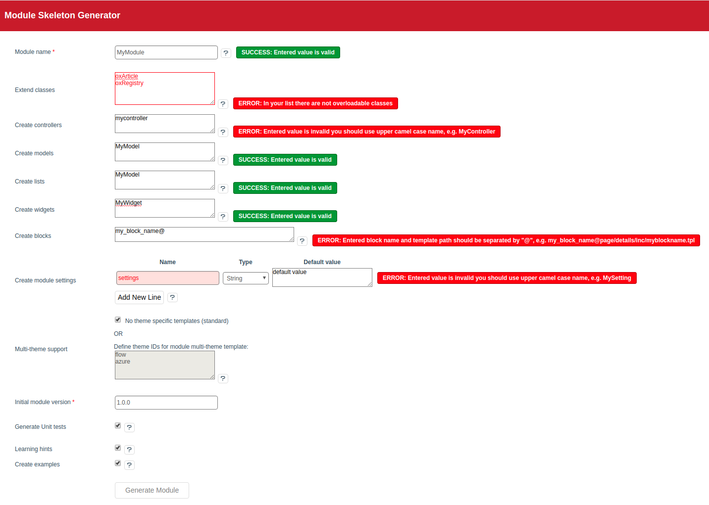
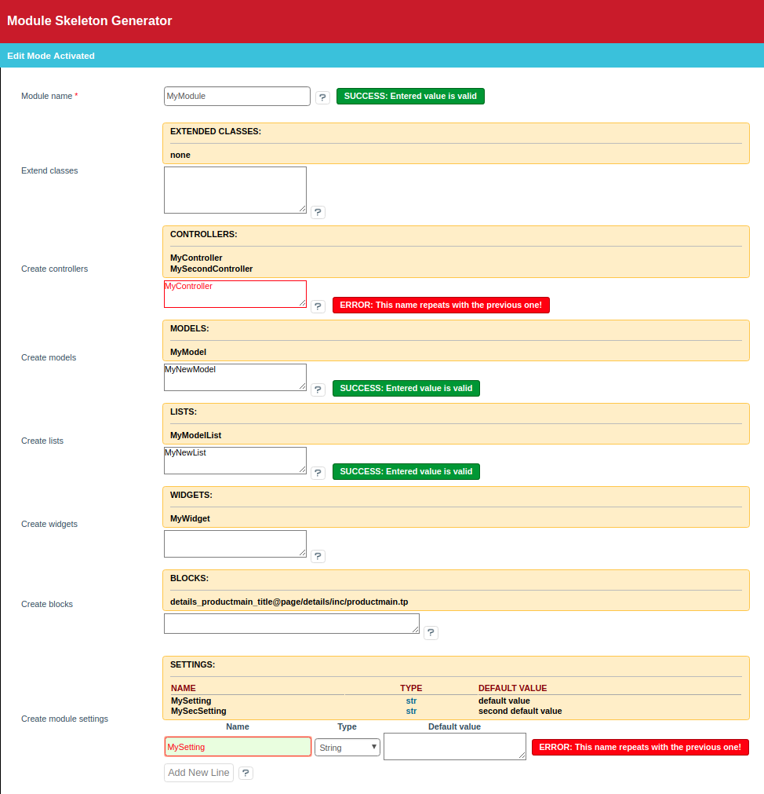

# OXID Module Skeleton Generator

----

Folders structure, empty classes and metadata generation for new OXID eShop modules.

### Concentrate only on features - let OXID Module Skeleton Generator create all the rest!
 * **Enter Your copyright data in the module settings**
 * **Open an easy to use Module Generator Wizard**
 * **Enter new module name and optional components**
 * **Press "Generate New Module"** 
 * **Update your composer autoloader** 
 * **And its done - new module is now ready to be activated and filled with features!**

## OXID Module Skeleton Generator features
 - Fully configurable vendor/author parameters for new modules creation
 - Vendor folder and vendor metadata automatic creation
 - Standard module folders structure creation
 - Completely filled module medatada file generation
 - Naming based on vendor data and module name
 - Created modules follow OXID standards
 - Automatic creation of pre-filled README file
 - Generation of PHP files comments with all vendor and module data
 - Main module class is included in each generated module
    - It contains activation/deactivation events
    - Support automatic SQL execution on the events
    - The class "knows" about its module and provides useful methods
 - Generation of skeleton files for...
    - Overloaded (extend) classes
    - New controllers (also templates are created)
    - Model classes
    - List model classes (linked with item model classes)
    - Widgets (also with templates)
 - Smarty blocks metadata and templates generation
 - Module settings metadata and translations generation
 - Translation files creation 
 - Module version
 - Automatic checkout of tests folder
    - And generation of pre-filled tests classes for each new module class
    - Configurable GIT repository URL to get tests folder from
 - Learning mode
    - Creation of hints and to do tasks inside generated files to help proceed with development
    - Sample source code generation to give a hint what each class could/should contain
 - Generated module is immediately working
    - Activate it and events, settings, blocks, controllers, etc. will already be in action!
 - Possibility to edit existing modules, generate/add extra files
 - Nice looking generation form with JS/AJAX events to validate and help enter proper values (shows notification messages)
 
## Installation
 - Copy the content of `copy_this/` folder to OXID eShop root folder
 - Make sure the Module Generator directory in module dir follows Pascal case naming pattern - `modules/oxps/ModuleGenerator`
 - Activate the module in administration area
 - Set eShop `modules/` folder writable while generating new modules

## Installation
 - `vagrant up`
 - `vagrant ssh`
 - Run `composer require oxid-esales/module-generator:v6.x-dev -d /var/www/oxideshop`

## Usage
 - Make sure eShop `modules/` folder (and also Your vendor sub-folder, if it exists) is writable
 - Log in to eShop administration area
 - (for first run) Go to _Extensions -> Modules -> OXID Module Skeleton Generator -> Settings -> Vendor and Copyright Settings_ and enter Your vendor, copyright and author data
 - Open _Module Generator -> Wizard_ (refresh page if it did not appear after module activation)
 - Enter a name for a new module in "UpperCamelCase" format, e.g. "MyModule"
 - (optionally) Enter any other options required in a new module (refer to help hints for more info)
 - Press "Generate New Module" button
 - The module skeleton source is now available in Your vendor sub-folder
 - Update composer.json and run 'composer dump-autoload' (refer to the notification that appears after module generation for more detailed info)
 - And the module could be activated already in _Extensions -> Modules_
## Screenshots
 <h4>Module generator</h4>
 
 <h4>Edit mode</h4>
 

## To do and nice to have features for future releases
 - Refactor longer classes to move some methods elsewhere
 - Extend blocks definition validation and blocks templates naming
 - Admin interface presets generation, also with menu.xml
 - Generate picture with PNG text overlay with real module name
 - PHPStorm style schemes (or some code beautifier) integration - after generation do code formatting
 - Copy not all folders, but only required ones (Refactor copyDir by providing "copy scenario" array)
 - dbEvent fail on multi-shops and multi-lang in real life projects - need PHP based DB installation

